# AI Engineering Toolbox Architecture

## System Overview

The AI Engineering Toolbox automation system follows a clear separation of concerns with a database-driven architecture for content management and templated generation.

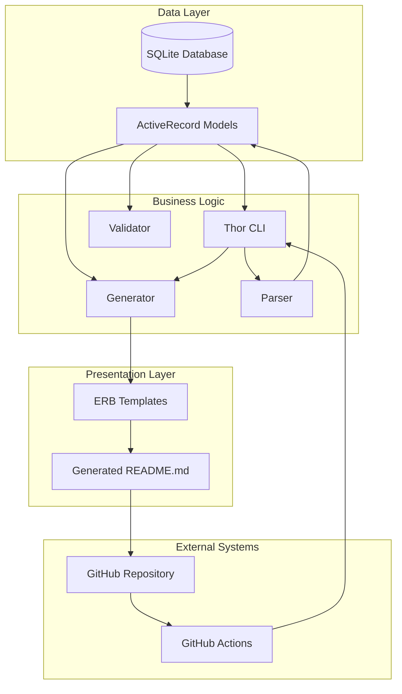

## Database Schema

The system uses SQLite with ActiveRecord for data persistence and object-relational mapping.

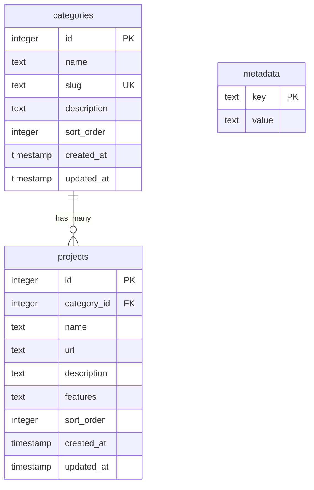

### Table Relationships

- **categories**: Master list of project categories with ordering
- **projects**: Individual tools/projects belonging to categories
- **metadata**: Key-value store for README header content and configuration

### Key Constraints

- Category slugs must be unique for URL generation
- Projects are ordered within categories via `sort_order`
- Categories are ordered globally via `sort_order`
- Features are stored as JSON arrays for flexible bullet points

## Component Architecture

### CLI Layer

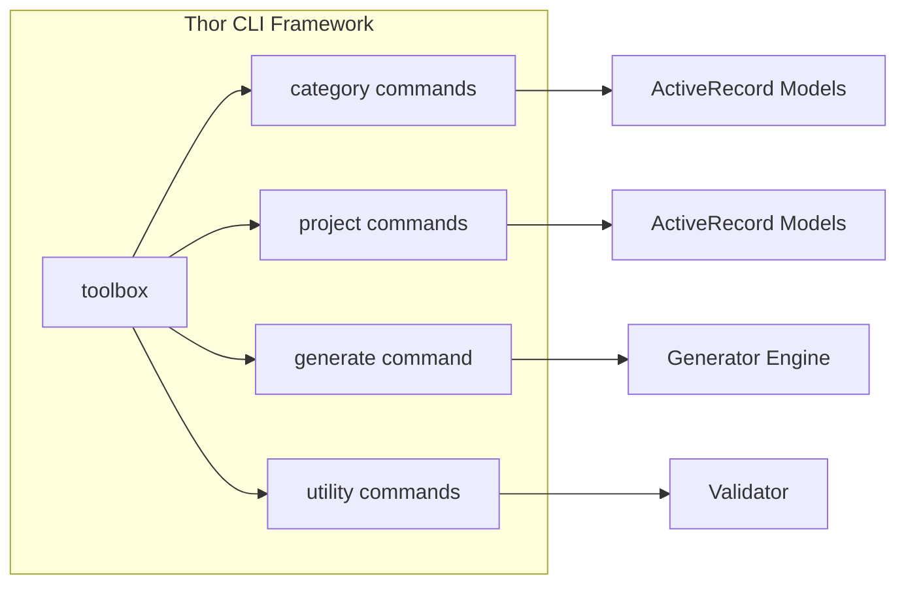

#### Command Structure

```
toolbox
├── init                    # Database initialization
├── category
│   ├── add                 # Create new category
│   ├── list                # List all categories
│   ├── update              # Modify category
│   └── delete              # Remove category
├── project
│   ├── add                 # Create new project
│   ├── list                # List projects (optionally filtered)
│   ├── update              # Modify project
│   └── delete              # Remove project
├── import                  # Import from JSON/CSV
├── export                  # Export to JSON/CSV
├── generate                # Generate README.md
├── validate                # Check data integrity
├── search                  # Search projects
└── stats                   # Database statistics
```

### Generation Pipeline

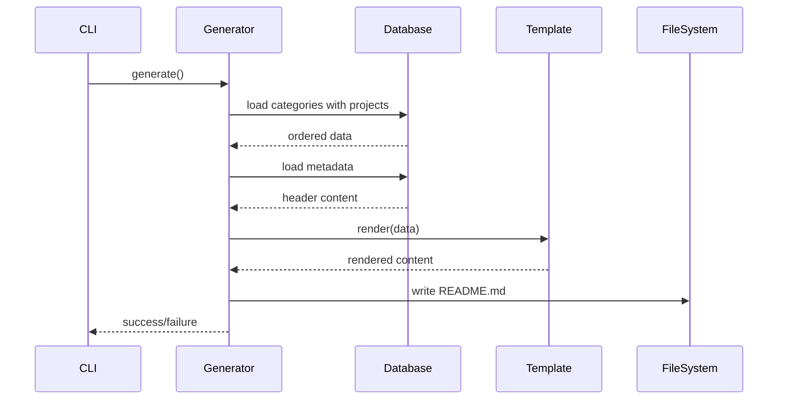

### Data Flow

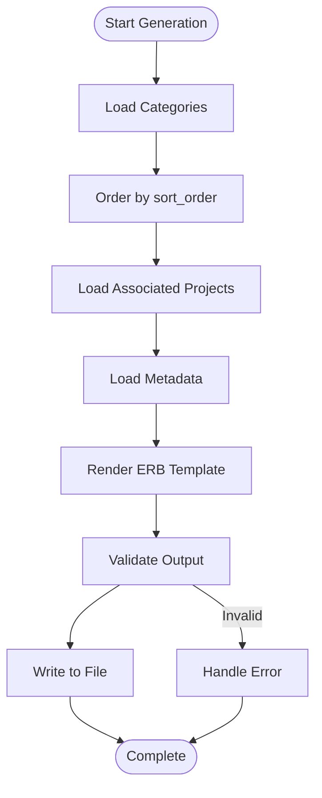

## Template System

The system uses ERB (Embedded Ruby) for template rendering with a single master template.

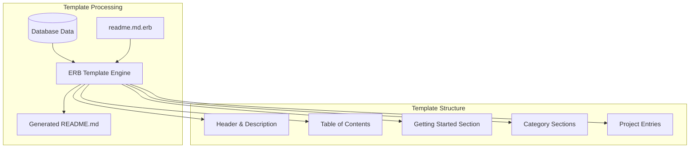

### Template Data Structure

```ruby
# Data structure passed to ERB template
{
  metadata: {
    'title' => 'AI Engineering Toolbox',
    'description' => 'A list of open-source tools...',
    'getting_started' => 'Content for getting started section'
  },
  categories: [
    {
      id: 1,
      name: 'Application Development Frameworks',
      slug: 'application-development-frameworks',
      description: 'Optional category description',
      projects: [
        {
          name: 'LangChain',
          url: 'https://github.com/langchain-ai/langchain',
          description: 'Framework for building LLM-powered applications',
          features: ['Component chaining', 'Third-party integrations']
        }
      ]
    }
  ]
}
```

## Migration & Parsing

The system includes a migration path from the current manual README to the database-driven approach.

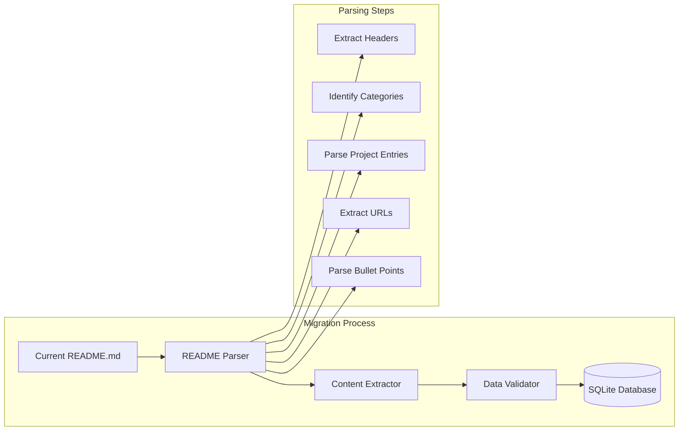

### Parser Logic

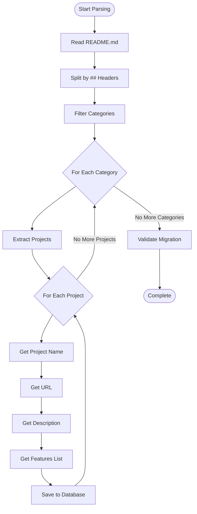

## File Organization

```
/workspaces/ai-engineering-toolbox/
├── lib/toolbox/
│   ├── cli/                     # CLI command classes
│   │   ├── base.rb              # Shared CLI functionality
│   │   ├── category.rb          # Category management commands
│   │   ├── project.rb           # Project management commands
│   │   └── generator.rb         # Generation commands
│   ├── models/                  # ActiveRecord models
│   │   ├── base.rb              # Base model class
│   │   ├── category.rb          # Category model
│   │   ├── project.rb           # Project model
│   │   └── metadata.rb          # Metadata model
│   ├── parsers/                 # Content parsing
│   │   └── readme_parser.rb     # README.md parser
│   ├── generators/              # Content generation
│   │   ├── base.rb              # Base generator
│   │   └── readme_generator.rb  # README generator
│   ├── validators/              # Data validation
│   │   ├── url_validator.rb     # URL health checks
│   │   └── data_validator.rb    # Data integrity
│   ├── database.rb              # Database setup and connection
│   └── version.rb               # Version information
├── db/
│   ├── migrate/                 # ActiveRecord migrations
│   └── seeds.rb                 # Seed data
├── templates/
│   └── readme.md.erb            # Master template
├── scripts/
│   ├── migrate_existing.rb      # Migration script
│   └── backup.rb                # Backup utilities
└── spec/                        # RSpec test suite
    ├── models/
    ├── cli/
    ├── generators/
    └── integration/
```

## Security & Data Integrity

### Data Validation

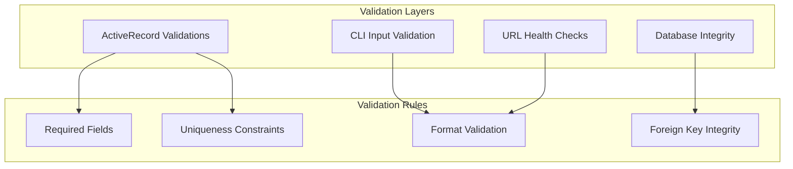

### Backup Strategy

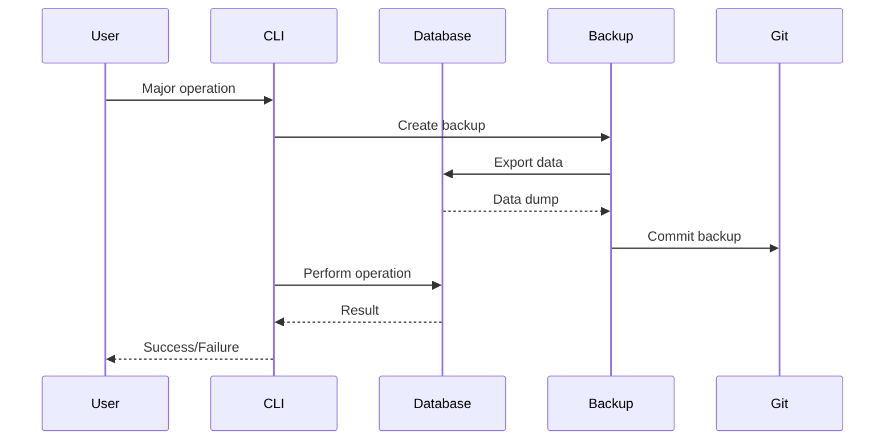

## Performance Considerations

### Query Optimization

- Categories and projects loaded with single queries using `includes()`
- Database indexes on frequently queried fields (`slug`, `sort_order`)
- Minimal data loading for generation (only required fields)

### Generation Performance

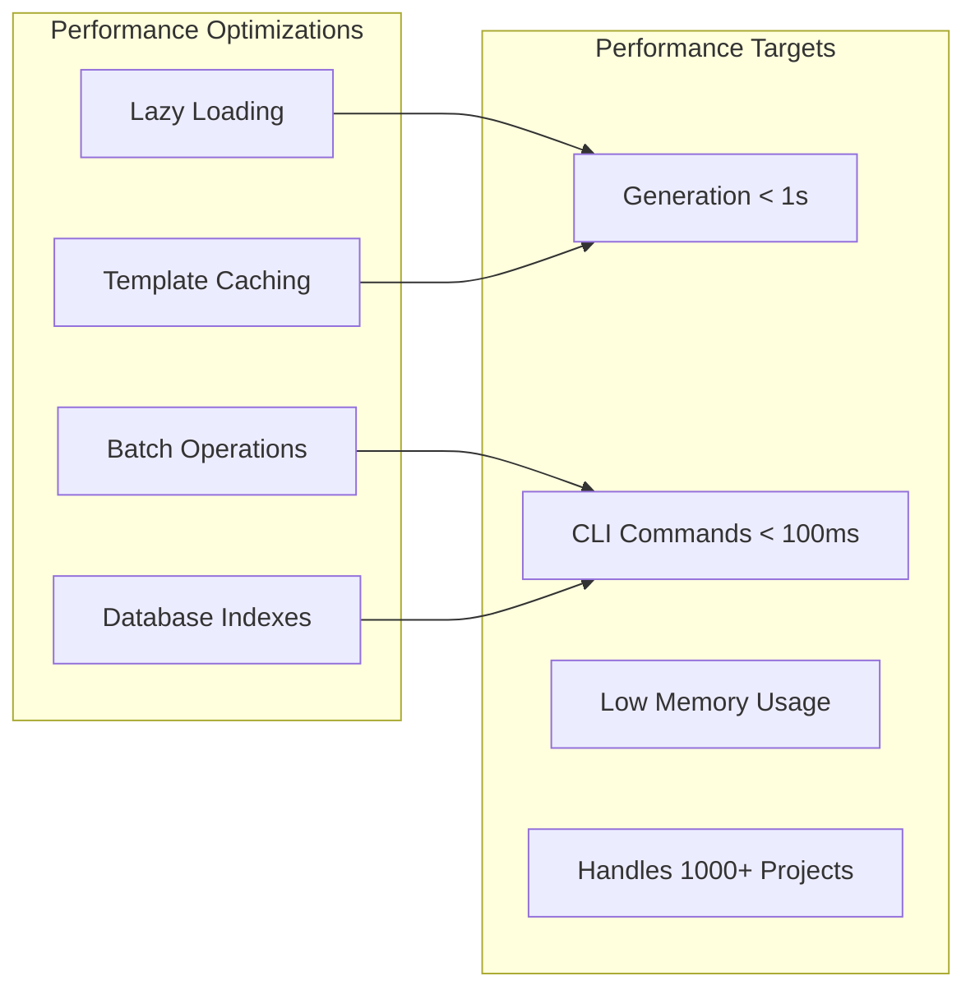

## Error Handling & Monitoring

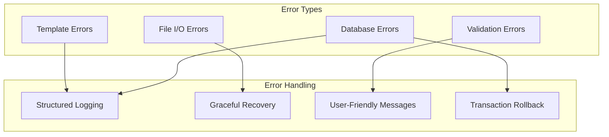

This architecture provides a robust, maintainable foundation for automating the AI Engineering Toolbox README generation while ensuring data integrity, performance, and ease of use.